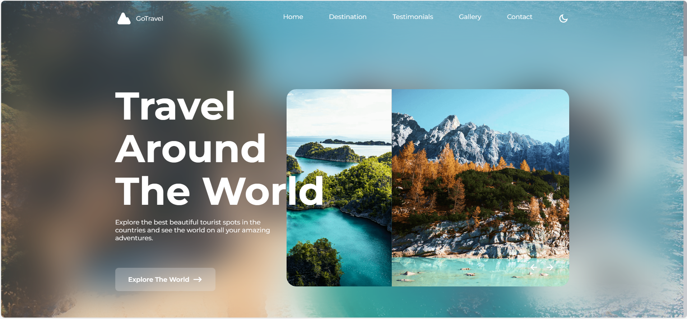

# 🌍 Travel Website

A modern and responsive travel website built with **HTML, CSS, and JavaScript**.  
Deployed on [Netlify](https://famous-faun-4dc8a7.netlify.app/).

---

## 🖼️ Preview
Here’s a sample of the website:

---

## ✨ Features
- Responsive design (mobile, tablet, desktop)
- Animated UI elements
- Destination showcase
- Clean and modern layout

---

## 🚀 Live Demo
👉 [View Website](https://famous-faun-4dc8a7.netlify.app/)

---

## 🛠️ Tech Stack
- HTML5
- CSS3
- JavaScript

---

## 📂 Project Structure
│── index.html
│── assets/
│ ├── css/
│ ├── js/
│ ├── img/

---

## 📌 Author
Made with ❤️ by [Rocky Kumar]
